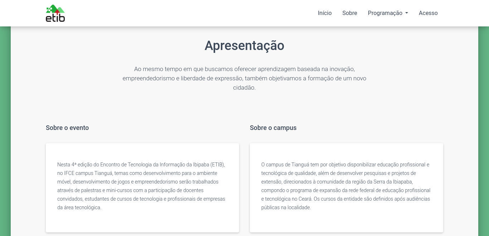
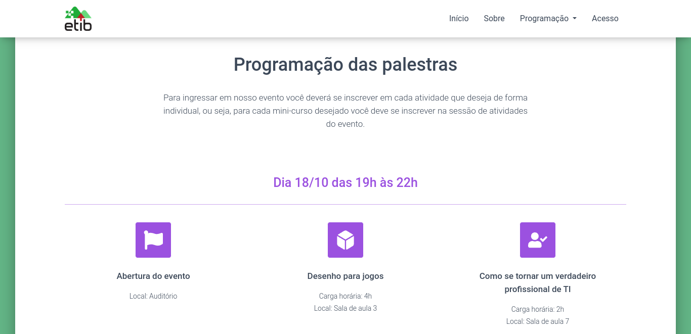
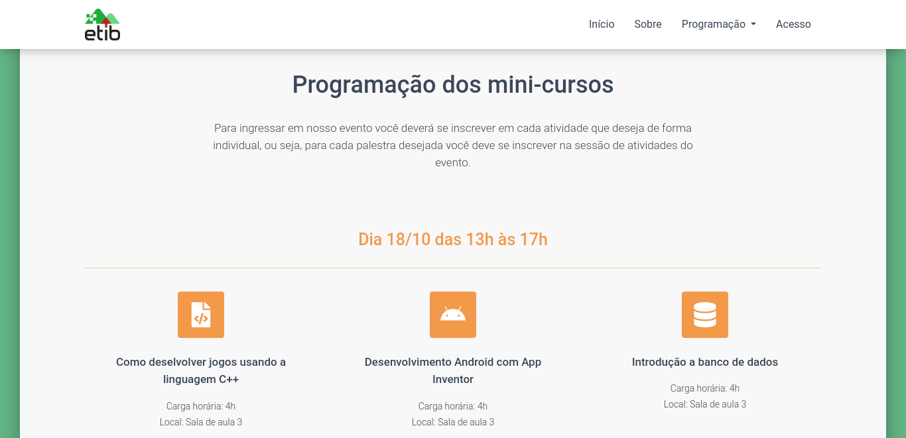

# Proposta de Landing Page do ETIB

O Encontro de Tecnologia da Informação da Ibiapaba (ETIB) é uma atividade de extensão do IFCE Campus Tianguá que objetiva contribuir para a troca de experiências entre profissionais e estudantes de TI, buscando a aproximação da comunidade estudantil com a indústria, o fortalecimento da parceria no desenvolvimento da Educação e da Informática e, ainda, o incentivo ao empreendedorismo ligado à Computação.

## Índice

<!--ts-->

- [Screenshots](#screenshots)
- [Tecnologias](#tecnologias)
- [Projeto](#projeto)
- [Pré-requisitos](#pré-requisitos)
- [Como usar](#como-usar)
- [Status](#status)
- [Contribuição](#contribuição)
- [Autores](#autores)
- [Licença](#licença)
<!--te-->

## Screenshots

- Início

- Sobre

- Palestras

- Mini-cursos

## Tecnologias

As seguintes ferramentas foram usadas no desenvolvimento do projeto:

- [HTML](https://developer.mozilla.org/en-US/docs/Web/HTML)
- [CSS](https://developer.mozilla.org/en-US/docs/Web/CSS)
- [JavaScript](https://developer.mozilla.org/en-US/docs/Web/JavaScript)
- [Figma](https://www.figma.com/)

## Projeto

Este repositório é o código inicial de um projeto realizado por uma equipe de estudantes da disciplina de Web Design no IFCE campus Tianguá.

## Pré-requisitos

Antes de começar, recomenda-se que você tenha as seguintes ferramentas instaladas em sua máquina:

- [VS Code](https://code.visualstudio.com/)
- [Git](https://git-scm.com)

## Como usar

Inicie o aplicativo no modo de desenvolvimento. Abra [http://localhost:3000](http://localhost:5500) para visualizá-lo em seu navegador.

## Status

Concluído ✅

## Contribuição

Pull requests não estão sendo aceitos no momento.

## Autores

**Pesquisa, wireframe e prototipação**

- Antonia Eduarda Ferreira
- Jefferson Nathan Silva Teles

**Web Design e Front-end**

- [Danilo C. de Sousa](https://github.com/danilocdesousa)

## Licença

[MIT](https://choosealicense.com/licenses/mit/)
